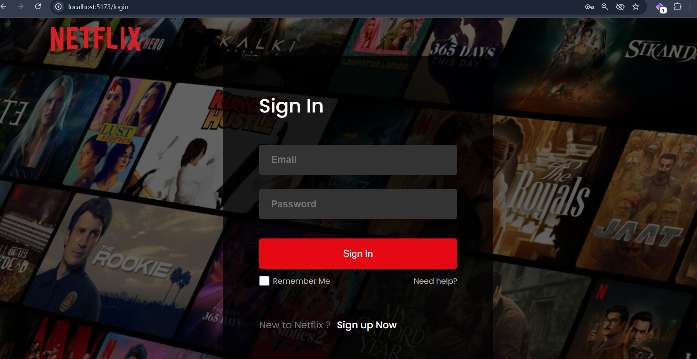

# Netflix Clone 🎬

A simple Netflix Clone built with **React**, **Firebase Authentication**, and **Firestore**.  
This project includes user authentication (signup, login, logout) and a responsive login form UI.

---

## 🚀 Features
- User **Signup/Login** with Firebase Authentication
- **Logout** functionality
- **Firestore Database** integration for storing user data
- **Responsive Login Form** styled with CSS
- Toast notifications using **react-toastify**

---

## 🛠️ Tech Stack
- **Frontend**: React, CSS
- **Backend/Database**: Firebase (Auth + Firestore)
- **Other Tools**: React Toastify

---

## 📦 Installation

1. Clone this repository:
  
   git clone https://github.com/rishnudk/netflix-clone.git
  

2. Navigate to the project folder:
  
   cd netflix-clone
  

3. Install dependencies:
    
   npm install
  

4. Create a Firebase project in the [Firebase Console](https://console.firebase.google.com/).  
   Copy your Firebase config and replace it inside `firebase.js`.

---

## ▶️ Running the Project

Start the development server:

npm run dev


Now open your browser and go to:

http://localhost:5173


---

## 📂 Folder Structure
```
src/
 ├── assets/         # Images & static files
 ├── components/     # React components (Navbar, Player, etc.)
 ├── pages/          # Page components (Login, Home, etc.)
 ├── firebase.js     # Firebase configuration & auth functions
 ├── App.jsx         # Main App component
 └── main.jsx        # React entry point
```

---

## 📸 Screenshots

### Login Page


### Home Page


---

## 🙌 Acknowledgements
- [React](https://reactjs.org/)
- [Firebase](https://firebase.google.com/)
- [React Toastify](https://fkhadra.github.io/react-toastify/)

---

## 📜 License
This project is for **educational purposes only** and is not affiliated with Netflix.
